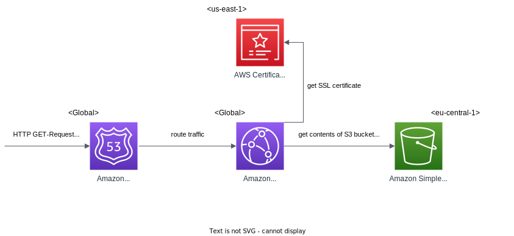

# Leander Christmann – Personal Portfolio Website <!-- omit in toc -->

## Table of Contents <!-- omit in toc -->

- [1. Installations \& Build](#1-installations--build)
- [2. Cloud Infrastructure](#2-cloud-infrastructure)
- [3. Deployment (CI/CD Pipeline)](#3-deployment-cicd-pipeline)

 

## 1. Installations & Build

<!-- TBD

 

### 1.1. Requirements

| Program | Min. Version | Check if installed |
|---|---|---|
| Ruby | Version 2.5.0 or higher | `ruby -v` |
| RubyGems | - | `gem -v` |
| GCC | - | `gcc -v` and `g++ -v` |
| Make | - | `make -v` |
| Bundler | - | `bundle -v` |

 

### 1.2. Build

To install the project's dependencies: run `bundle install` in the root directory of this project.

To have the website up and running locally on port 4000: execute `bundle exec jekyll serve` or just `jekyll serve`.

To remove the generated files: `jekyll clean` and delete the `Gemfile.lock` file.

-->

 

## 2. Cloud Infrastructure

The following diagram shows the cloud infrastructure the site is running on.

1. Incoming requests to the domain `lchristmann.com` first arrive at **Route53**, because it has the authoritative name servers responsible for my domain. Here will be the value of the "DNS A record" returned, which is `d3f84kvtb8w7pm.cloudfront.net`.
2. This value is the endpoint of my **CloudFront** distribution (a content delivery network). It serves cached copies of my static website's files, which I have put in an S3 bucket.
3. This CloudFront distribution takes a SSL certificate created for "lchristmann.com" in **AWS Certificate Manager** and applies it to the website's connections.
4. The origin from which CloudFront takes these website files is an **S3 bucket** named "lchristmann.com", where I put all the static files that make up my website.

 

Explanation of the different regions:

- Route53 and CloudFront are global services
- the S3 bucket is located in Frankfurt (eu-central-1), because it's is the preferred and closest region for me
- the SSL certificate is located in North Virginia (us-east-1), because this is the only region allowed by the CloudFront service for certificates.

 

> This architecture is currently only implemented for the `lchristmann.com` site, which is the English version. The `lchristmann.de` site will follow with a German version soon after.

 

## 3. Deployment (CI/CD Pipeline)

We could manually deploy this website by uploading the contents of the `_site` directory to the S3 bucket and invalidating the CloudFront distribution's cache. But for the sake of saving time and effort in the future, we will automate this process with a CI/CD pipeline using GitHub Actions.

This pipeline will be triggered by every commit in the Git repository.

1. A GitHub runner will checkout the code in the repository.
2. It will first setup ruby, including its package mangager `gem`.
3. It will install all the dependencies, like `bundler` and `jekyll`.
4. It will generate the static site from the project.
5. It will deploy those static files to the "lchristmann.com" S3 bucket.
6. It will invalidate the CloudFront distribution's cache, so the changes are are effective immediately.

 