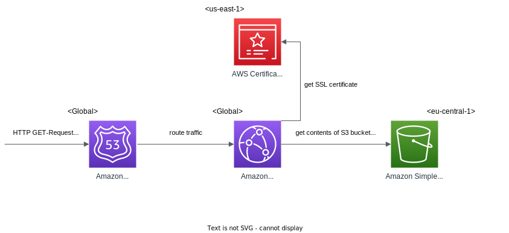

# Romaji2Kana Website <!-- omit in toc -->

## Table of Contents <!-- omit in toc -->

- [1. Installations \& Build](#1-installations--build)
  - [1.1. Installation](#11-installation)
  - [1.2. Development (Continuous) Build](#12-development-continuous-build)
  - [1.3. Production Build](#13-production-build)
- [2. Cloud Infrastructure](#2-cloud-infrastructure)
- [3. Deployment (CI/CD Pipeline)](#3-deployment-cicd-pipeline)

 

## 1. Installations & Build

 

[Tailwind CSS](https://tailwindcss.com/) is installed via the [standalone executable](https://tailwindcss.com/blog/standalone-cli), which is the recommended way of doing it for projects that aren't using Node.js and npm already and don't want to require it.

### 1.1. Installation

> As described in the previously linked blog article

1. Download the latest executable for you platform - in my case the `tailwindcss-windows-x64.exe`
2. Rename the file to `tailwindcss.exe` for easier usage
3. Make it executable: right click it > Properties > Security > Permissions for System > Edit > Full Access > Apply
4. Create the tailwind.config.js file: `.\tailwindcss.exe init`
   - add the project files that use Tailwind CSS classes to the `content` array in this file

 

### 1.2. Development (Continuous) Build

Start a watcher, i.e. a process that watches the files specified in the `content` array from the `tailwind.config.js`: `.\tailwindcss.exe -i css/input.css -o css/output.css --watch`

- When something changes (and you press "save"!) it automatically recompiles the CSS into the `css/output.css` stylesheet, which is included in the HTML pages.
- It looks at the Tailwind directives in `css/input.css` to determine which utility classes' existence to even consider and check for.

 

### 1.3. Production Build

Compile and minify the CSS for production: `.\tailwindcss.exe -i css/input.css -o css/output.css --minify`

 

## 2. Cloud Infrastructure

The following diagram shows the cloud infrastructure the site is running on.

1. Incoming requests to the domain `romaji2kana.com` first arrive at **Route53**, because it has the authoritative name servers responsible for my domain. Here will be the value of the "DNS A record" returned, which is `d15f3h5j74nmwf.cloudfront.net`.
2. This value is the endpoint of my **CloudFront** distribution (a content delivery network). It serves cached copies of my static website's files, which I have put in an S3 bucket.
3. This CloudFront distribution takes a SSL certificate created for "romaji2kana.com" in **AWS Certificate Manager** and applies it to the website's connections.
4. The origin from which CloudFront takes these website files is an **S3 bucket** named "romaji2kana.com", where I put all the static files that make up my website.

 

Explanation of the different regions:

- Route53 and CloudFront are global services
- the S3 bucket is located in Frankfurt (eu-central-1), because it's is the preferred and closest region for me
- the SSL certificate is located in North Virginia (us-east-1), because this is the only region allowed by the CloudFront service for certificates.

 

## 3. Deployment (CI/CD Pipeline)

A GitHub Actions CI/CD pipeline synchronizes all `.html` files and the `logo.svg` file to the S3 bucket.

This pipeline will be triggered by every commit in the Git repository.

1. A GitHub runner will checkout the code in the repository.
2. It will deploy the files to the "romaji2kana.com" S3 bucket.
3. It will invalidate the CloudFront distribution's cache, so the changes are are effective immediately.

 