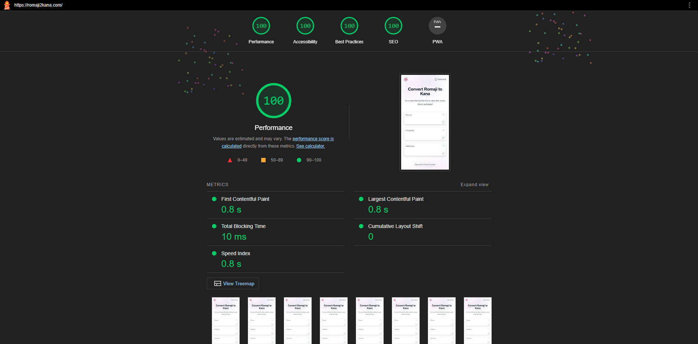

# Romaji2Kana Website <!-- omit in toc -->

## Table of Contents <!-- omit in toc -->

- [1. Installations \& Build](#1-installations--build)
  - [1.1. Installation](#11-installation)
  - [1.2. Development (Continuous) Build](#12-development-continuous-build)
  - [1.3. Production Build](#13-production-build)
- [2. Dependencies](#2-dependencies)
- [3. Cloud Infrastructure](#3-cloud-infrastructure)
- [4. Deployment (CI/CD Pipeline)](#4-deployment-cicd-pipeline)
- [5. SEO](#5-seo)

 

## 1. Installations & Build

 

[Tailwind CSS](https://tailwindcss.com/) is installed via the [standalone executable](https://tailwindcss.com/blog/standalone-cli), which is the recommended way of doing it for projects that aren't using Node.js and npm already and don't want to require it.

### 1.1. Installation

No further actions needed - everything required for this project...

- has been installed into this repository already (Tailwind)
- or is included externally (Wanakana translation library, Alpine Js)

 

### 1.2. Development (Continuous) Build

Start a watcher, i.e. a process that watches the files specified in the `content` array from the `tailwind.config.js`:

- Windows: `.\tailwindcss.exe -i css/input.css -o css/output.css --watch`
- Linux: `./tailwindcss -i css/input.css -o css/output.css --watch`

How it works:

- When something changes (and you press "save"!) it automatically recompiles the CSS into the `css/output.css` stylesheet, which is included in the HTML pages.
- It looks at the Tailwind directives in `css/input.css` to determine which utility classes' existence to even consider and check for.

 

### 1.3. Production Build

Compile and minify the CSS for production:

- Windows: `.\tailwindcss.exe -i css/input.css -o css/output.css --minify`
- Linux: `./tailwindcss -i css/input.css -o css/output.css --minify`

 

## 2. Dependencies

- [WanaKana](https://github.com/WaniKani/WanaKana): a JavaScript library for detecting and transliterating Hiragana, Katakana and Romaji in all directions
- [Alpine Js](https://alpinejs.dev/): a lightweight JavaScript framework, used here to build (the modal open and close functionality) and the animations, which would've been hard without: [Tailwind uses Alpine for this as well, if you inspect their code](https://tailwindui.com/components/application-ui/overlays/notifications). Knowledge required can be acquired via [this course](https://youtube.com/playlist?list=PLfdtiltiRHWF0T2HE1D4hxN4vaeh4wW3g&si=-NDei8ze6Z5zhAPV) and specifically [this video](https://youtu.be/tFj4y4QjPvc?si=_tqtHnlIBm9QR4Ss).

 

## 3. Cloud Infrastructure

The following diagram shows the cloud infrastructure the site is running on.

1. Incoming requests to the domain `romaji2kana.com` first arrive at **Route53**, because it has the authoritative name servers responsible for my domain. Here will be the value of the "DNS A record" returned, which is `d15f3h5j74nmwf.cloudfront.net`.
2. This value is the endpoint of my **CloudFront** distribution (a content delivery network). It serves cached copies of my static website's files, which I have put in an S3 bucket.
3. This CloudFront distribution takes a SSL certificate created for "romaji2kana.com" in **AWS Certificate Manager** and applies it to the website's connections.
4. The origin from which CloudFront takes these website files is an **S3 bucket** named "romaji2kana.com", where I put all the static files that make up my website.

 

Explanation of the different regions:

- Route53 and CloudFront are global services
- the S3 bucket is located in Frankfurt (eu-central-1), because it's is the preferred and closest region for me
- the SSL certificate is located in North Virginia (us-east-1), because this is the only region allowed by the CloudFront service for certificates.

 

## 4. Deployment (CI/CD Pipeline)

A GitHub Actions CI/CD pipeline synchronizes all `.html` files and the `logo.svg` file to the S3 bucket.

This pipeline will be triggered by every commit in the Git repository.

1. A GitHub runner will checkout the code in the repository.
2. It will deploy the files to the "romaji2kana.com" S3 bucket.
3. It will invalidate the CloudFront distribution's cache, so the changes are are effective immediately.

 

## 5. SEO

Search-engine optimization has been done via:

- good content: providing exactly what a visitor would want in a very fast and easily accessible way
- great UI & UX: will reflect over time in search engines' metrics like traffic and bounce rate
- `meta` tags (basic ones + [Open Graph Tags](https://ogp.me/))
- keywords (in the respective `meta` tag and in the text  of the websites)
- semantic HTML (e.g. `header`, `nav`, `main`, `article`, `footer`, `code`)
- ARIA attributes for accessibility
- Sitemap (`sitemap.txt`) to help search engines discover all my URLs so they can crawl and index them
- insane performance
- some backlinks (currently one in each GitHub + StackOverflow)

Lighthouse report with perfect score:

 